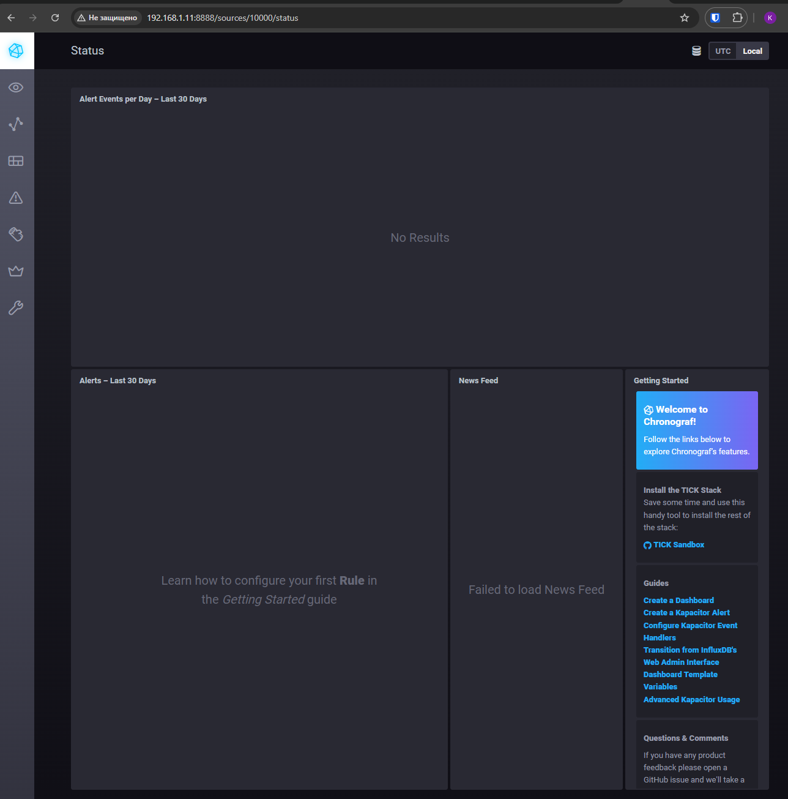
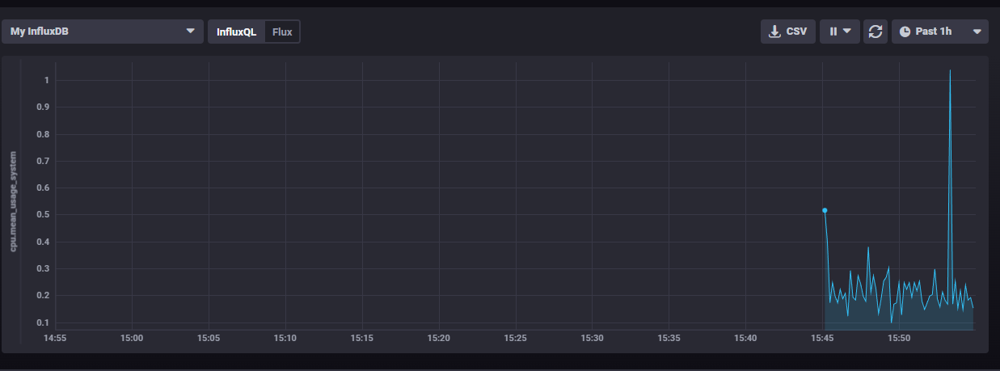
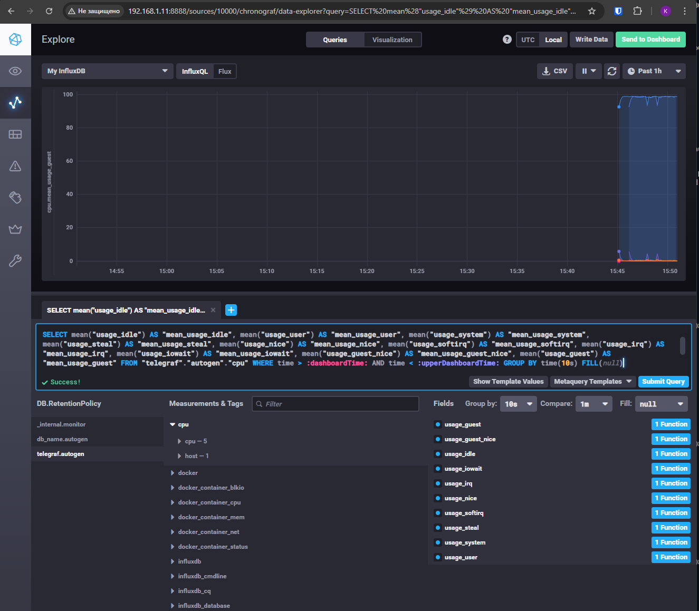

# Домашнее задание к занятию "13.Системы мониторинга" - Крюков Егор

## Обязательные задания

1. Вас пригласили настроить мониторинг на проект. На онбординге вам рассказали, что проект представляет из себя 
платформу для вычислений с выдачей текстовых отчетов, которые сохраняются на диск. Взаимодействие с платформой 
осуществляется по протоколу http. Также вам отметили, что вычисления загружают ЦПУ. Какой минимальный набор метрик вы
выведите в мониторинг и почему?

### Ответ
#### **Системные метрики**
1. **CPU usage / CPU load**
   Вычисления грузят процессор поэтому важно отслеживать загрузку, чтобы понимать хватает ли мощности
2. **RAM usage**
   Вычисления могут потреблять много оперативной памяти что может привести к падению сервисов
3. **Disk usage**
   Отчеты сохраняются на диск, нужно следить за его размером диска, чтобы он не переполнился
4. **Disk I/O (iowait, read/write)**
   Генерация отчётов может быть I/O-интенсивной. Если диск будет нагружен то будут задержки в работе
5.  Inodes usage
   При большом количестве отчётов можно забить не только место, но также и количество inode
   
#### **Метрики приложения и HTTP**
6. **Количество HTTP-запросов**
   Нужны для понимания понимание нагрузки
7. **Коды ответов HTTP** (2xx / 4xx / 5xx)
   Дляя контроля работоспособности приложения
8. **Latency**
   Важно знать какая скорость ответа


#
2. Менеджер продукта посмотрев на ваши метрики сказал, что ему непонятно что такое RAM/inodes/CPUla. Также он сказал, 
что хочет понимать, насколько мы выполняем свои обязанности перед клиентами и какое качество обслуживания. Что вы 
можете ему предложить?

### Ответ
Менеджеру можно предложить организовать бизнес метрики. Такие как показатели SLA/SLO, графики успешных/ошибочных запросов, так же можно предложить метрики производительности, но с понятной формулировкой.


#
3. Вашей DevOps команде в этом году не выделили финансирование на построение системы сбора логов. Разработчики в свою 
очередь хотят видеть все ошибки, которые выдают их приложения. Какое решение вы можете предпринять в этой ситуации, 
чтобы разработчики получали ошибки приложения?

### Ответ
Есть решение без затрат. Использовать Использовать Loki + Promtail. Такое решение минимально по затратам на ресурсы

#
4. Вы, как опытный SRE, сделали мониторинг, куда вывели отображения выполнения SLA=99% по http кодам ответов. 
Вычисляете этот параметр по следующей формуле: summ_2xx_requests/summ_all_requests. Данный параметр не поднимается выше 
70%, но при этом в вашей системе нет кодов ответа 5xx и 4xx. Где у вас ошибка?

### Ответ
Неправильная формула. Формула должна быть такой `SLA = sum(2xx) / sum(2xx + 4xx + 5xx)` нужно исключить 1xx и 3xx, так как они не отражают качество

#
5. Опишите основные плюсы и минусы pull и push систем мониторинга.

### Ответ
pull 
Плюсы - простая архитектура, легко контролировать, откуда и что собирается, безопасность - агенты не инициируют соединение, не захламляет метриками
Минусы - нужна доступность конечная точки, сложно собирать метрики с устройств за nat

push
Плюсы - подходит для nat и динамических ip, можно отправлять метрики в несколько систем, удобна при огромном количестве агентов
Минусы - нужна защита входящего потока данных, сложно контролировать потерю метрик, агенты могут заспамить сервер

#
6. Какие из ниже перечисленных систем относятся к push модели, а какие к pull? А может есть гибридные?

    - Prometheus - pull, частично гибрид
    - TICK - push
    - Zabbix - гибрид
    - VictoriaMetrics - гибрид
    - Nagios - pull, частично гибрид
   
#
7. Склонируйте себе [репозиторий](https://github.com/influxdata/sandbox/tree/master) и запустите TICK-стэк, 
используя технологии docker и docker-compose.

В виде решения на это упражнение приведите скриншот веб-интерфейса ПО chronograf (`http://localhost:8888`). 



P.S.: если при запуске некоторые контейнеры будут падать с ошибкой - проставьте им режим `Z`, например
`./data:/var/lib:Z`
#
8. Перейдите в веб-интерфейс Chronograf (http://localhost:8888) и откройте вкладку Data explorer.
        
    - Нажмите на кнопку Add a query
    - Изучите вывод интерфейса и выберите БД telegraf.autogen
    - В `measurments` выберите cpu->host->telegraf-getting-started, а в `fields` выберите usage_system. Внизу появится график утилизации cpu.
    - Вверху вы можете увидеть запрос, аналогичный SQL-синтаксису. Поэкспериментируйте с запросом, попробуйте изменить группировку и интервал наблюдений.

Для выполнения задания приведите скриншот с отображением метрик утилизации cpu из веб-интерфейса.



#
9. Изучите список [telegraf inputs](https://github.com/influxdata/telegraf/tree/master/plugins/inputs). 
Добавьте в конфигурацию telegraf следующий плагин - [docker](https://github.com/influxdata/telegraf/tree/master/plugins/inputs/docker):
```
[[inputs.docker]]
  endpoint = "unix:///var/run/docker.sock"
```

Дополнительно вам может потребоваться донастройка контейнера telegraf в `docker-compose.yml` дополнительного volume и 
режима privileged:
```
  telegraf:
    image: telegraf:1.4.0
    privileged: true
    volumes:
      - ./etc/telegraf.conf:/etc/telegraf/telegraf.conf:Z
      - /var/run/docker.sock:/var/run/docker.sock:Z
    links:
      - influxdb
    ports:
      - "8092:8092/udp"
      - "8094:8094"
      - "8125:8125/udp"
```

После настройке перезапустите telegraf, обновите веб интерфейс и приведите скриншотом список `measurments` в 
веб-интерфейсе базы telegraf.autogen . Там должны появиться метрики, связанные с docker.


